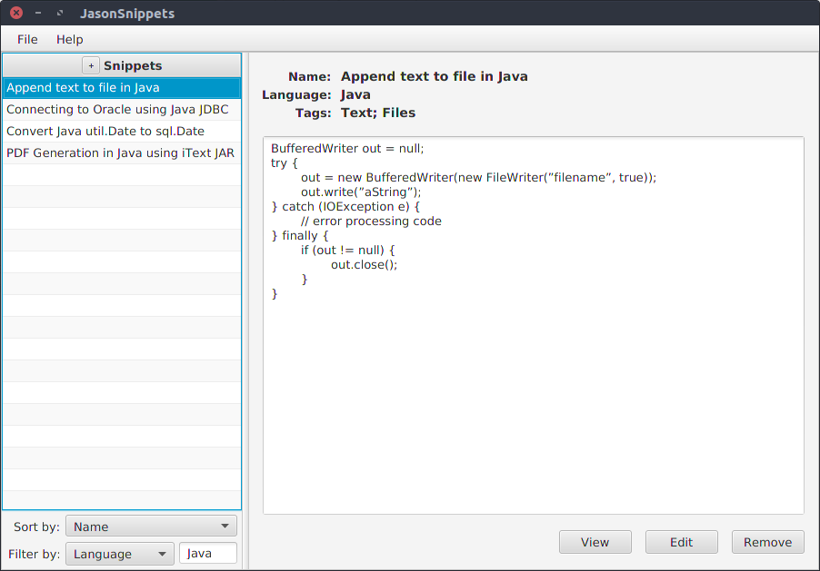
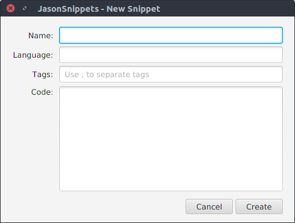

# JasonSnippets

  

Desktop application to manage code snippets.

## Mockup

## Current State

## Roadmap

I will use sprints to determine the stages of development that I want to follow.

* **Sprint 1**: Create data model, interfaces and mockup UI.
* **Sprint 2**: Develop the presentation of the application until it is usable.
* **Sprint 3**: Create complete data model. Add tagging system.
* **Sprint 4**: Create an extensible persistence system (connectors approach).
* **Sprint 5**: Implement search system (name, language and tag based).
* **Sprint 6**: Implement other features (font resize, themes, etc).

## Setup

Your operating system and java virtual machine must meet the minimum specifications needed to play an application with JavaFX technology:
[JavaFX 2 Certified System Configurations](http://www.oracle.com/technetwork/java/javafx/downloads/supportedconfigurations-1506746.html)

If your configuration is correct you just have to run the jar to run the application.

TODO: Add customized installations according to operating system or linux distribution.

## Usage

* Create a new snippet: File -> New Snippet / Plus button / Ctrl+N
* View a snippet: Click snippet in left table and snippet information will appear in right area. Using "View" button, snippet will be opened in configured code text editor (for example atom, sublime text, eclipse, etc).

TODO: edit

## 3rd party software

* JavaFX (http://docs.oracle.com/javase/8/javase-clienttechnologies.htm)

## License

[GNU General Public License v3](https://www.gnu.org/licenses/gpl-3.0.en.html "GNU General Public License v3")
